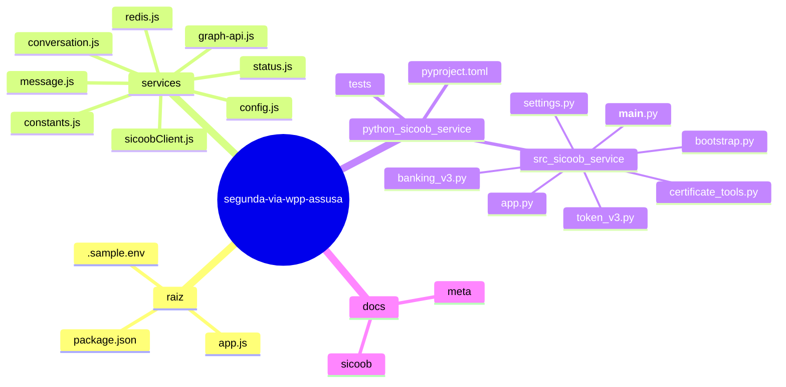
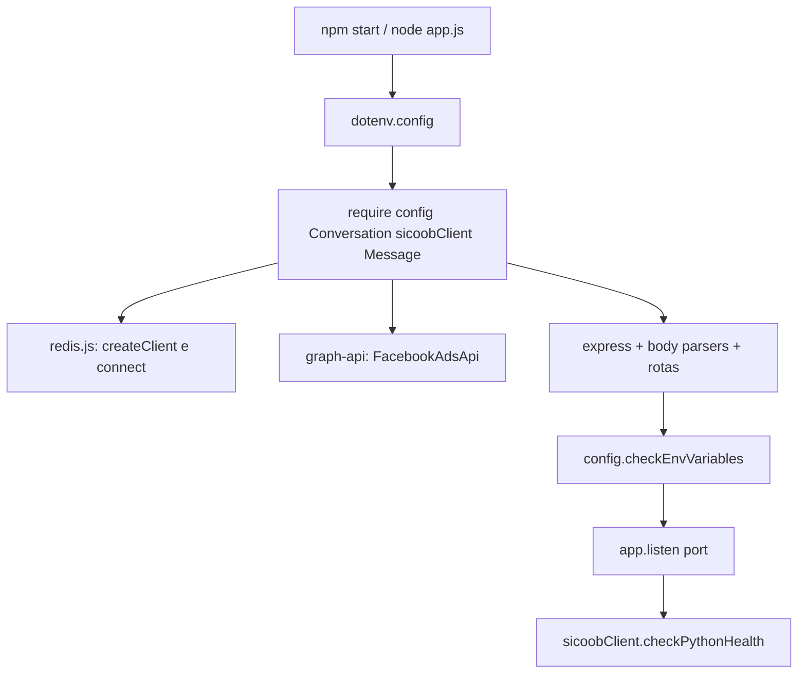
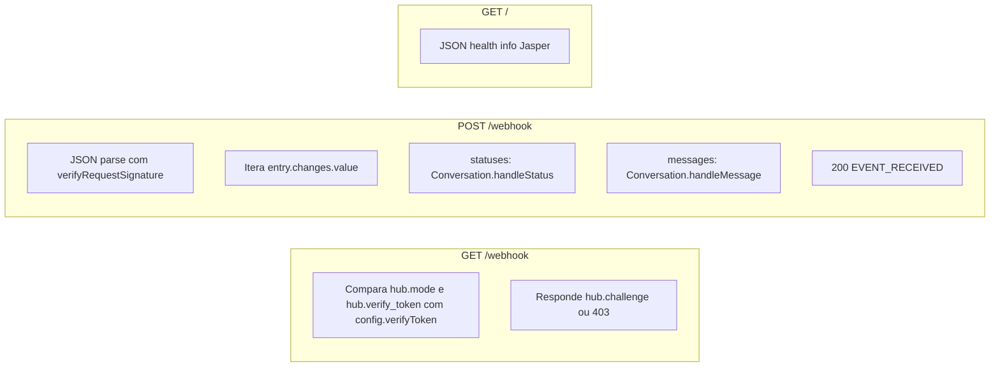

# Mapa mental e fluxo lógico do projeto

Este repositório tem **dois processos** independentes: o **servidor Node (Express + WhatsApp)** na raiz e o **microsserviço FastAPI (Sicoob)** em [`python/sicoob_service/`](../python/sicoob_service/). O Node só **consulta** o Python no arranque (`checkPythonHealth`); a função [`segundaViaBoleto`](../services/sicoobClient.js) está pronta para integração futura mas **não** entra no fluxo atual de mensagens.

---

## 1. Mapa mental das pastas e ficheiros

**Papel de cada pasta**

- **Raiz**: ponto de entrada Node ([`app.js`](../app.js)), dependências ([`package.json`](../package.json)), variáveis de exemplo ([`.sample.env`](../.sample.env)).
- **[`services/`](../services/)**: toda a lógica do webhook WhatsApp (conversa, Graph API, Redis, config) e cliente HTTP para o Python.
- **[`python/sicoob_service/`](../python/sicoob_service/)**: API interna Sicoob (uvicorn/FastAPI), certificados, testes.
- **[`docs/`](.)**: contexto e contratos (não faz parte do runtime do servidor).

---

## 2. Inicialização do Node e arranque do servidor

Ordem real de execução quando corre `npm start` → `node app.js`:

| Ordem | O que acontece | Onde |
|------|----------------|------|
| 1 | `require('dotenv').config()` (segunda vez em [`config.js`](../services/config.js) também) | [`app.js`](../app.js) L13; [`config.js`](../services/config.js) L11 |
| 2 | Carrega módulos: `config`, `Conversation`, `sicoobClient`, `Message` | [`app.js`](../app.js) L16–19 |
| 3 | Ao carregar `Conversation` → cadeia `Cache` → [`redis.js`](../services/redis.js): `createClient` + `client.connect()` (efeito lateral) | [`conversation.js`](../services/conversation.js) L15; [`redis.js`](../services/redis.js) L13–24 |
| 4 | Ao carregar `GraphApi` → `FacebookAdsApi(config.accessToken)` | [`graph-api.js`](../services/graph-api.js) L10–13 |
| 5 | `express()`, `app.use(urlencoded)`, `app.use(json({ verify: verifyRequestSignature }))` | [`app.js`](../app.js) L20–30 |
| 6 | Registo de rotas: `GET /webhook`, `POST /webhook`, `GET /` | [`app.js`](../app.js) L33–85 |
| 7 | `config.checkEnvVariables()` — avisos se faltam env vars | [`app.js`](../app.js) L88; [`config.js`](../services/config.js) L33–38 |
| 8 | `app.listen(config.port, async () => { ... })` → log porta; `sicoobClient.checkPythonHealth()` | [`app.js`](../app.js) L110–123 |

**Funções nomeadas no arranque**

- [`verifyRequestSignature`](../app.js) — middleware de verificação HMAC `x-hub-signature-256` (corre em cada `POST` com body JSON).
- [`config.checkEnvVariables`](../services/config.js) — percorre `ENV_VARS` e faz `console.warn` se faltar variável.
- [`sicoobClient.checkPythonHealth`](../services/sicoobClient.js) — `GET {SICOOB_SERVICE_URL}/health` (ou `skipped` se URL não configurada).

---

## 3. Fluxo HTTP após o servidor a escuta

---

## 4. Funções na cadeia de mensagens e estado

**[`Conversation.handleMessage`](../services/conversation.js)** (estático)

- Instancia `Message(rawMessage)`.
- `switch (message.type)` sobre IDs em [`constants.js`](../services/constants.js).
- Chama funções internas ao ficheiro: `sendTryOutDemoMessage`, `sendInteractiveMediaMessage`, `sendLimitedTimeOfferMessage`, `sendMediaCarouselMessage`, `markMessageForFollowUp`.
- `markMessageForFollowUp` → [`Cache.insert`](../services/redis.js).

**[`Conversation.handleStatus`](../services/conversation.js)**

- Instancia `Status(rawStatus)`.
- Filtra só `delivered` / `read`.
- Se [`Cache.remove`](../services/redis.js)(`messageId`) devolver verdadeiro → `sendTryOutDemoMessage` com mensagem de follow-up.

**[`GraphApi`](../services/graph-api.js)** (métodos estáticos; chamada real via `#makeApiCall` privado)

- `messageWithInteractiveReply`, `messageWithUtilityTemplate`, `messageWithLimitedTimeOfferTemplate`, `messageWithMediaCardCarousel`.

**Modelos**

- [`Message` constructor](../services/message.js) — extrai `id`, `type` (de `interactive.button_reply.id` ou `'unknown'`), `from`.
- [`Status` constructor](../services/status.js) — `id`, `status`, `recipient_id`.

**Cliente Sicoob (Node)**

- [`baseUrl`](../services/sicoobClient.js), [`internalHeaders`](../services/sicoobClient.js), [`checkPythonHealth`](../services/sicoobClient.js), [`segundaViaBoleto`](../services/sicoobClient.js) — esta última alinha com `POST /internal/boleto/segunda-via` no Python.

---

## 5. Inicialização do microsserviço Python (referência)

- Entrada típica: `python -m sicoob_service` ou comando definido no pacote → [`__main__.py`](../python/sicoob_service/src/sicoob_service/__main__.py) chama `get_settings()` e `uvicorn.run("sicoob_service.app:app", ...)`.
- [`app.py`](../python/sicoob_service/src/sicoob_service/app.py): instância `FastAPI`, rotas `/health`, `/internal/boleto/*` com `verify_internal_key` e `banking_dependency` → [`create_banking_client`](../python/sicoob_service/src/sicoob_service/bootstrap.py) → [`BankingSicoobV3`](../python/sicoob_service/src/sicoob_service/banking_v3.py).
