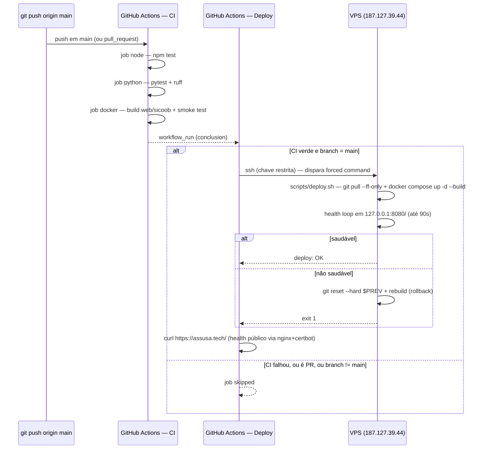

# CI/CD — do commit em `main` até a VPS

Desde 2026-07-23 o deploy é automático. Este documento descreve o fluxo completo, os
segredos envolvidos, como rotacionar a chave de deploy e como diagnosticar problemas.
Para o checklist de produção (env vars, backups, etc.), ver [PRODUCAO.md](PRODUCAO.md).

## Fluxo



Dois health gates independentes: o loop dentro de `deploy.sh` (pega container que não
sobe) e o `curl` público no workflow (pega proxy/nginx/certificado quebrado — algo que o
loopback nunca veria).

## Workflows

| Arquivo | Gatilho | O que faz |
|---|---|---|
| [`.github/workflows/ci.yml`](../.github/workflows/ci.yml) | `push` em `main`, `pull_request` | 3 jobs em paralelo: `node` (`npm test`), `python` (`pytest` + `ruff check --exit-zero`), `docker` (build das 2 imagens + sobe o container `web` e confere `GET /` e `GET /app.js`) |
| [`.github/workflows/deploy.yml`](../.github/workflows/deploy.yml) | `workflow_run` do CI (só roda se `conclusion == success` e `head_branch == main`), ou `workflow_dispatch` manual | SSH até a VPS com a chave restrita → dispara `scripts/deploy.sh` → confere `https://assusa.tech/` publicamente |
| [`scripts/deploy.sh`](../scripts/deploy.sh) | executado pelo Deploy (ou à mão na VPS) | `git pull --ff-only` → `docker compose up -d --build` → health loop → rollback automático (`git reset --hard` + rebuild) se falhar |

`ruff` roda como baseline não bloqueante (`--exit-zero`) — hoje aponta 9 avisos, nenhum
travando o CI. Torná-lo bloqueante é uma mudança deliberada futura, não acidental.

## Secrets (GitHub → Settings → Secrets and variables → Actions)

| Secret | Valor | Como obter de novo |
|---|---|---|
| `VPS_HOST` | `187.127.39.44` | — |
| `VPS_USER` | `root` | — |
| `VPS_SSH_KEY` | chave **privada** de `assusa_deploy_ci` | ver rotação abaixo |
| `VPS_KNOWN_HOSTS` | saída de `ssh-keyscan -t ed25519 187.127.39.44` | reexecutar o comando |

O ambiente `production` (usado em `deploy.yml`) existe no repo sem regras de proteção —
deploy roda sozinho, sem aprovação manual, por decisão deliberada (ver histórico de chat).
Para adicionar um gate de aprovação manual depois: Settings → Environments →
`production` → Required reviewers.

## A chave de deploy é restrita — não é a sua chave pessoal

Em `/root/.ssh/authorized_keys` na VPS, a chave `gh-actions-deploy-assusa` tem um
`command=` forçado:

```
command="/root/segunda-via-wpp-assusa/scripts/deploy.sh",no-agent-forwarding,no-port-forwarding,no-pty,no-user-rc,no-X11-forwarding ssh-ed25519 AAAA... gh-actions-deploy-assusa
```

Isso significa: **não importa o que o cliente SSH mande executar**, essa chave só roda
`scripts/deploy.sh`. Testado na prática mandando `whoami; cat /etc/shadow` — ignorado,
rodou o deploy mesmo assim. Se esse secret vazar, o dano máximo é "disparar um deploy do
que já está em `main`", não shell arbitrário na máquina que guarda o token da Meta, as
credenciais Sicoob e o certificado mTLS.

Sua chave pessoal (`~/.ssh/id_ed25519_vps_nova`) continua sem restrição, para
administração manual (logs, debug, editar `.env`/`certificados/`).

### Rotacionar a chave de deploy

```bash
ssh-keygen -t ed25519 -f ~/.ssh/assusa_deploy_ci_novo -C "gh-actions-deploy-assusa" -N ""
# na VPS, com a chave pessoal:
ssh -i ~/.ssh/id_ed25519_vps_nova root@187.127.39.44
#   editar /root/.ssh/authorized_keys: trocar a linha antiga pela nova (mesmo prefixo command=...)
gh secret set VPS_SSH_KEY --repo joaovianaamr/Assusa < ~/.ssh/assusa_deploy_ci_novo
# apagar a chave antiga do disco local e da VPS
```

## Rollback manual

O script já faz rollback sozinho se o health check falhar depois do deploy. Se precisar
reverter manualmente (ex.: bug que passa no health check mas quebra em produção depois):

```bash
ssh -i ~/.ssh/id_ed25519_vps_nova root@187.127.39.44 \
  'cd /root/segunda-via-wpp-assusa && git reset --hard <sha-bom> && docker compose up -d --build'
```

Achar o SHA bom: `git log --oneline` local, ou `gh run list` para ver qual commit tinha
Deploy verde.

## Diagnosticar um deploy que falhou

1. `gh run list --repo joaovianaamr/Assusa --limit 5` — ver se CI ou Deploy falharam
2. `gh run view <id> --repo joaovianaamr/Assusa --log-failed` — log do step que falhou
3. Se o Deploy rodou mas o site não respondeu: entrar na VPS com a chave pessoal e rodar
   `docker compose logs --tail 100 web` e `docker compose ps` — o rollback automático já
   deve ter revertido, mas os logs explicam o motivo original
4. Conferir se a VPS está no SHA esperado: `git -C /root/segunda-via-wpp-assusa rev-parse --short HEAD`

## Disparo manual (sem esperar push)

```bash
gh workflow run deploy.yml --repo joaovianaamr/Assusa
```

Útil para reaplicar o `main` atual sem precisar de um commit novo (ex.: depois de mexer
em algo direto na VPS por engano e querer forçar a reconciliação pelo pipeline).
