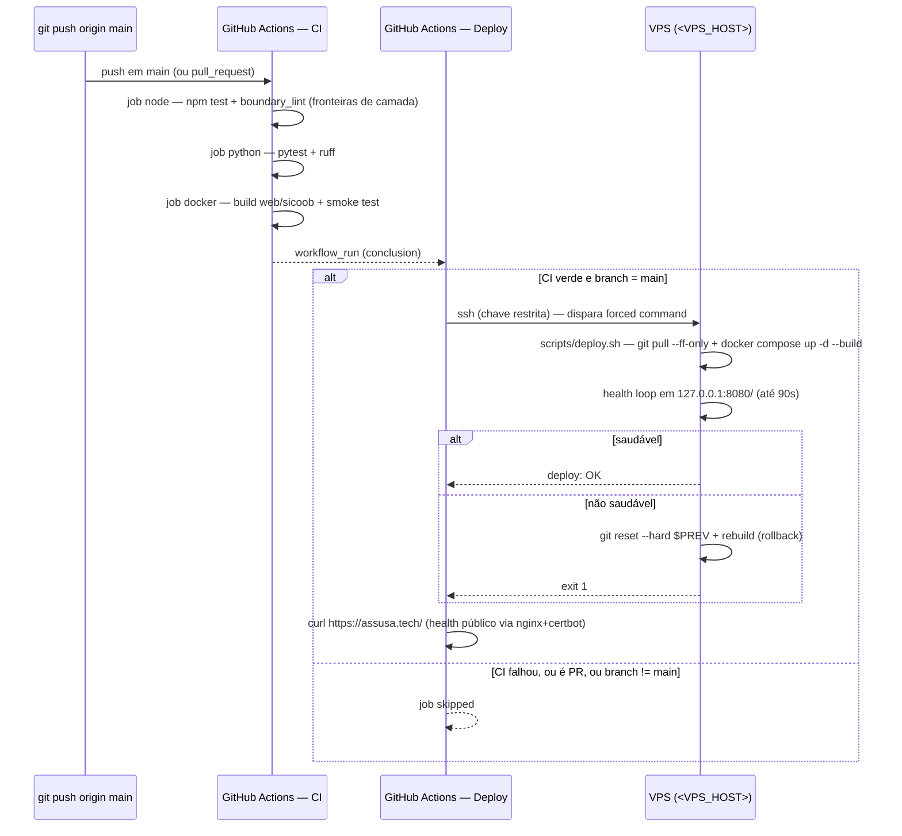

# CI/CD — do commit em `main` até a VPS

Desde 2026-07-23 o deploy é automático. Este documento descreve o fluxo completo, os
segredos envolvidos, como rotacionar a chave de deploy e como diagnosticar problemas.
Para o checklist de produção (env vars, backups, etc.), ver [PRODUCAO.md](PRODUCAO.md).

## Fluxo


```mermaid
sequenceDiagram
    participant Dev as git push origin main
    participant CI as GitHub Actions — CI
    participant Deploy as GitHub Actions — Deploy
    participant VPS as VPS (<VPS_HOST>)

    Dev->>CI: push em main (ou pull_request)
    CI->>CI: job node — npm test + boundary_lint (fronteiras de camada)
    CI->>CI: job python — pytest + ruff
    CI->>CI: job docker — build web/sicoob + smoke test
    CI-->>Deploy: workflow_run (conclusion)
    alt CI verde e branch = main
        Deploy->>VPS: ssh (chave restrita) — dispara forced command
        VPS->>VPS: scripts/deploy.sh — git pull --ff-only + docker compose up -d --build
        VPS->>VPS: health loop em 127.0.0.1:8080/ (até 90s)
        alt saudável
            VPS-->>Deploy: deploy: OK
        else não saudável
            VPS->>VPS: git reset --hard $PREV + rebuild (rollback)
            VPS-->>Deploy: exit 1
        end
        Deploy->>Deploy: curl https://assusa.tech/ (health público via nginx+certbot)
    else CI falhou, ou é PR, ou branch != main
        Deploy-->>Deploy: job skipped
    end
```

Dois health gates independentes: o loop dentro de `deploy.sh` (pega container que não
sobe) e o `curl` público no workflow (pega proxy/nginx/certificado quebrado — algo que o
loopback nunca veria).

## Workflows

| Arquivo | Gatilho | O que faz |
|---|---|---|
| [`.github/workflows/ci.yml`](../.github/workflows/ci.yml) | `push` em `main`, `pull_request` | 3 jobs em paralelo: `node` (`npm test` + `boundary_lint.py`), `python` (`pytest` + `ruff check --exit-zero`), `docker` (build das 2 imagens + smoke test do container — ver abaixo) |
| [`.github/workflows/deploy.yml`](../.github/workflows/deploy.yml) | `workflow_run` do CI (só roda se `conclusion == success` e `head_branch == main`), ou `workflow_dispatch` manual | SSH até a VPS com a chave restrita (**3 tentativas**, só em falha de conexão) → dispara `scripts/deploy.sh` → confere `https://assusa.tech/` publicamente |
| [`scripts/deploy.sh`](../scripts/deploy.sh) | executado pelo Deploy (ou à mão na VPS) | **`flock`** → `git pull --ff-only` → `docker compose up -d --build` → health loop → rollback automático (`git reset --hard` + rebuild) se falhar |

### Por que o retry só vale para falha de conexão

O `ssh` devolve **255** para erro próprio (não conectou, autenticação). Qualquer outro código vem
do `deploy.sh` rodando na VPS — health check reprovando, rollback — e aí o deploy falhou de
verdade: repetir esconderia o problema. O step distingue os dois casos.

Sobra um caso que o código de saída não separa: a conexão cair **depois** que o `deploy.sh` já
começou também devolve 255, e a tentativa seguinte dispararia um segundo deploy por cima do
primeiro. É para isso que existe o `flock` no script — `-n` para falhar na hora em vez de
enfileirar, e saída 0, porque um deploy já em andamento não é erro, é redundância.

`ruff` roda como baseline não bloqueante (`--exit-zero`) — hoje aponta 9 avisos, nenhum
travando o CI. Torná-lo bloqueante é uma mudança deliberada futura, não acidental.

### O que cada verificação do CI protege

Nenhuma delas está ali por praxe; cada uma nasceu de um problema real.

| Verificação | Job | Existe porque |
|---|---|---|
| `npm test` | node | 103 testes, rodando **sem Redis** — a suíte precisa continuar assim |
| `boundary_lint.py --root api` | node | as camadas de `api/` só valem se alguém reprovar quando uma seta apontar para fora. Falha o build, não avisa |
| `pytest` | python | 48 testes do cliente Sicoob |
| `ruff --exit-zero` | python | baseline de estilo, deliberadamente não bloqueante |
| `find web -name '*.js'` | docker | uma cópia do código-fonte já ficou pública por semanas a partir do diretório estático |
| `curl / \| grep ASSUSA` | docker | a raiz precisa servir a **página**, não JSON |
| `curl /status \| grep "Servidor ativo"` | docker | o diagnóstico legível por máquina mudou de endereço quando a página ocupou a raiz |
| `curl /logo-assusa.png` = 200 | docker | a página referencia a logo; sem rota explícita ela daria 404 |
| `curl /app.js` = 404 | docker | o código-fonte não pode ser servido — mesma origem do item de `web/` |

O smoke test do `docker` roda `docker run` **sem `--env-file`**: o container precisa subir sem
nenhuma variável de ambiente. Foi essa verificação que pegou o adapter da Meta construindo o
cliente do SDK no import (`new FacebookAdsApi(undefined)` lança), e é ela que continua guardando
a propriedade junto com `test/arranqueSemEnv.test.js`.

## Secrets (GitHub → Settings → Secrets and variables → Actions)

| Secret | Valor | Como obter de novo |
|---|---|---|
| `VPS_HOST` | `<VPS_HOST>` | — |
| `VPS_USER` | `root` | — |
| `VPS_SSH_KEY` | chave **privada** de `assusa_deploy_ci` | ver rotação abaixo |
| `VPS_KNOWN_HOSTS` | saída de `ssh-keyscan -t ed25519 <VPS_HOST>` | reexecutar o comando |

O ambiente `production` (usado em `deploy.yml`) existe no repo sem regras de proteção —
deploy roda sozinho, sem aprovação manual, por decisão deliberada (ver histórico de chat).
Para adicionar um gate de aprovação manual depois: Settings → Environments →
`production` → Required reviewers.

## A chave de deploy é restrita — não é a sua chave pessoal

Em `/root/.ssh/authorized_keys` na VPS, a chave `gh-actions-deploy-assusa` tem um
`command=` forçado:

```
command="/root/segunda-via-wpp-assusa/scripts/deploy.sh",no-agent-forwarding,no-port-forwarding,no-pty,no-user-rc,no-X11-forwarding ssh-ed25519 AAAA... gh-actions-deploy-assusa
```

Isso significa: **não importa o que o cliente SSH mande executar**, essa chave só roda
`scripts/deploy.sh`. Testado na prática mandando `whoami; cat /etc/shadow` — ignorado,
rodou o deploy mesmo assim. Se esse secret vazar, o dano máximo é "disparar um deploy do
que já está em `main`", não shell arbitrário na máquina que guarda o token da Meta, as
credenciais Sicoob e o certificado mTLS.

Sua chave pessoal (`~/.ssh/id_ed25519_vps_nova`) continua sem restrição, para
administração manual (logs, debug, editar `.env`/`certificados/`).

### Rotacionar a chave de deploy

```bash
ssh-keygen -t ed25519 -f ~/.ssh/assusa_deploy_ci_novo -C "gh-actions-deploy-assusa" -N ""
# na VPS, com a chave pessoal:
ssh -i ~/.ssh/id_ed25519_vps_nova root@<VPS_HOST>
#   editar /root/.ssh/authorized_keys: trocar a linha antiga pela nova (mesmo prefixo command=...)
gh secret set VPS_SSH_KEY --repo joaovianaamr/Assusa < ~/.ssh/assusa_deploy_ci_novo
# apagar a chave antiga do disco local e da VPS
```

## Rollback manual

O script já faz rollback sozinho se o health check falhar depois do deploy. Se precisar
reverter manualmente (ex.: bug que passa no health check mas quebra em produção depois):

```bash
ssh -i ~/.ssh/id_ed25519_vps_nova root@<VPS_HOST> \
  'cd /root/segunda-via-wpp-assusa && git reset --hard <sha-bom> && docker compose up -d --build'
```

Achar o SHA bom: `git log --oneline` local, ou `gh run list` para ver qual commit tinha
Deploy verde.

## Rollback automático — validado em produção

Testado de propósito em 2026-07-23 (commits `4c3d918` → `e7b1856`), não só por leitura do
código. Quebra usada: `PORT: "8081"` no ambiente do serviço `web` em `docker-compose.yml`,
mantendo a porta publicada em `8080:8080` — o container sobe sem erro, mas nada escuta na
porta exposta. Invisível ao smoke test do CI (que roda `docker run` direto na imagem, sem
`docker-compose.yml`), então o CI passou e o Deploy dessa mudança quebrada disparou de
verdade contra a VPS.

Log real do job (`gh run view --log`):
```
23:16:53  deploy: current=4e90683ba7ee098e32d31958877f9e1a5a66584f
23:17:12  container web sobe com a config quebrada
          web-1 | The app is listening on port 8081
23:18:42  deploy: HEALTH FAILED — rolling back to 4e90683ba7ee098e32d31958877f9e1a5a66584f
23:19:00  container web sobe de novo, com a config revertida
23:19:02  deploy: rolled back to 4e90683ba7ee098e32d31958877f9e1a5a66584f
          exit code 1 (correto — marca o run como failure mesmo tendo se recuperado)
```

Resultado observado por fora (monitor de `https://assusa.tech/` rodando em paralelo,
independente do log do deploy): `200 → 502` no início da quebra, `502 → 200` em +160s,
sem nenhuma ação manual. VPS terminou no SHA correto (`4e90683`), confirmado via SSH com
a chave pessoal — canal separado do que a pipeline usou.

Conclusão: o rollback automático não é só teoria — foi provado sob uma falha real (site
fora do ar, não simulado) e se recuperou sozinho.

## Diagnosticar um deploy que falhou

1. `gh run list --repo joaovianaamr/Assusa --limit 5` — ver se CI ou Deploy falharam
2. `gh run view <id> --repo joaovianaamr/Assusa --log-failed` — log do step que falhou
3. Se o Deploy rodou mas o site não respondeu: entrar na VPS com a chave pessoal e rodar
   `docker compose logs --tail 100 web` e `docker compose ps` — o rollback automático já
   deve ter revertido, mas os logs explicam o motivo original
4. Conferir se a VPS está no SHA esperado: `git -C /root/segunda-via-wpp-assusa rev-parse --short HEAD`

### `ssh: connect to host *** port 22: Connection timed out`

**O workflow agora absorve isso sozinho** — desde jul/2026 o step de SSH tenta 3 vezes, com
10 s e 20 s entre elas. Se você está vendo essa mensagem no log mas o deploy terminou verde,
foi só uma tentativa perdida e não há nada a fazer.

**Se as três falharem**, aí sim vale investigar — mas comece pelo mais provável, que continua
sendo instabilidade transitória de rede: espere ~30 min e re-rode.

Em 28/07/2026 duas tentativas seguidas falharam assim (19:49 e 19:54), incluindo um
`gh run rerun` imediato — e meia hora depois o mesmo deploy passou sozinho, sem nenhuma
mudança de configuração. Foi janela de indisponibilidade de rede entre os runners e a VPS.

O sintoma engana: durante a falha o `journalctl -u ssh` na VPS **não registra tentativa
nenhuma**, o que parece prova de bloqueio permanente. Não é — pacote perdido no caminho produz
exatamente o mesmo silêncio. E **não há firewall na VPS** (`ufw` inativo, `iptables INPUT` com
policy ACCEPT e sem regras), então não adianta procurar bloqueio ali nem no painel do provedor.

Ordem de diagnóstico:

```bash
curl -sI https://assusa.tech            # a VPS está viva?
ssh <VPS_USER>@<VPS_HOST> true          # a porta 22 responde de outra origem?
# as duas passaram? é transitório: espere e re-rode o workflow
```

Se precisar publicar sem esperar, a saída manual faz exatamente o que o runner faria:

```bash
ssh <VPS_USER>@<VPS_HOST> 'cd /root/segunda-via-wpp-assusa && bash scripts/deploy.sh'
```

> A unit do SSH na VPS chama-se **`ssh.service`**, não `sshd.service` — vale para o
> `journalctl` e para qualquer ferramenta que leia esse log.

## Disparo manual (sem esperar push)

```bash
gh workflow run deploy.yml --repo joaovianaamr/Assusa
```

Útil para reaplicar o `main` atual sem precisar de um commit novo (ex.: depois de mexer
em algo direto na VPS por engano e querer forçar a reconciliação pelo pipeline).
